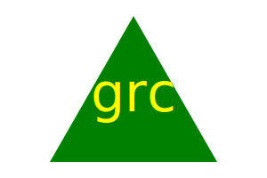

# SVG Logo Maker

## Description
This application produces SVG logos based on user input for web designers, reducing the need for a graphic designer. With this app, more time will be allotted towards creating the application, and there will be less money spent for a logo.

## Installation
1. Download the repository by running `git clone <SSH key>` in the command line.
2. Run `npm i` in the command line to install all necessary dependencies(inquirer, inquirer-maxlength-input-prompt, jest).

## Usage
Run `node index.js` in the command line, and a series of prompts will appear. Prompts will ask the user what text to put in, the color of the text, the shape of the logo, and the color of the shape. When all prompts are answered, a new svg file (`logo.svg`) will be created.

### Link to video walkthrough
https://drive.google.com/file/d/1sOV9CqtSwQiKXLHe7OLe90DtfhZ6KxrX/view?usp=share_link

### Image of logo created in video walkthrough

Click [here](./logo.svg) to see the `logo.svg` file

## Credit
* Code for tests provided by Bryan Swarthout
* Code in `shape.js` and `svg.js` written with help from Scott McAnally (tutor)

## License
This repository is licensed under the [MIT License](https://opensource.org/licenses/MIT).

## Tests
To test the application, run `npm run test` in the command line.